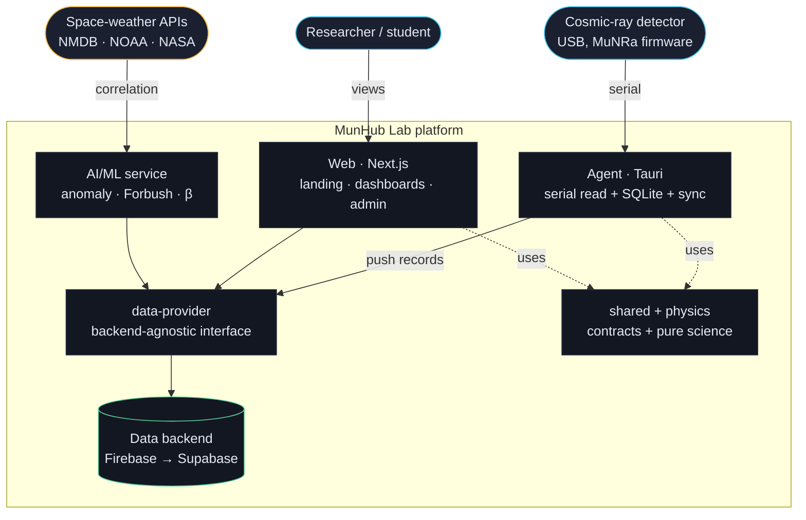

# MunHub Lab — Architecture (technical overview)

> Public, English distillation of [`planning/01-ARCHITECTURE.md`](../../planning/01-ARCHITECTURE.md)
> and the AFLEK kit (<https://github.com/alexanderkholodov1/AFLEK>, pinned in `FLEET-VERSION`).
> Status: pre-alpha — describes the target design and what already exists.

## 0. C4 view (Context + Container)



- **Level 1 (Context):** researchers and detectors interact with MunHub; MunHub pulls space-weather
  data for correlation.
- **Level 2 (Container):** the agent, web app, data-provider, pure core, data backend, and AI
  service. **Level 3 (Component)** is documented per package as each is built.

## 1. Principles

1. **Provider-agnostic data.** The app never talks to Firebase/Supabase directly; everything goes
   through `packages/data-provider`. Changing backend = changing one implementation.
2. **Offline-first at the edge.** The local agent persists data (SQLite) before syncing; the
   detector never loses data on network or power loss.
3. **Scientific integrity by contract.** Invariants — *averages never sums*, *no event filtering* —
   are enforced by `zod` schemas in `packages/shared`, not by convention.
4. **One source of truth for types.** Models, schema, and constants live in `packages/shared` and
   are consumed by web, agent, api, and ai.
5. **Security by default.** Deny-by-default rules; secrets never in the repo; data redundancy is a
   requirement, not an option.
6. **Edge processing.** Heavy work (per-minute averaging, feature extraction, validation) happens
   on the detector's PC (the agent), keeping the server/bandwidth light. This is what lets the
   platform run indefinitely on a free cloud tier.

## 2. Components

```
packages/shared          TypeScript types, zod schemas, constants, i18n keys, pure utilities
packages/physics         Pure science: dead-time & barometric correction, flux, Landau spectrum
packages/data-provider   DataProvider interface + FirebaseProvider (Phase A) + SupabaseProvider (Phase B)
packages/ui              Observatory Dark design system — token foundation LANDED (spec 0008):
                           CSS custom properties (dark/light), Tailwind v4 @theme, ThemeProvider,
                           Button, Card, Stat primitives; Geist Sans + Mono; Lucide icons.

apps/web (Next.js)       Public landing, dashboards (station/admin), external-correlation pages.
                           Shell LANDED (spec 0008): App Router, output:"export" → out/ (Firebase
                           Hosting static, Phase A), Observatory Dark wired, / + /dashboard routes.
apps/agent (Tauri)       Cross-platform serial reading + local SQLite + offline sync queue

services/api             (Phase B) backend / edge functions: ingest, aggregations, jobs
services/ai              (Phase B) ML pipeline (anomaly detection, Forbush, barometric β)
```

**Allowed dependencies:** `web`, `agent`, `api`, `ai` may depend on `shared`, `data-provider`,
`physics`; `web` also on `ui`. `shared` and `physics` depend on **nothing with I/O** (pure,
independently testable). `data-provider` depends only on `shared`.

## 3. The data-provider layer (keystone)

A single `DataProvider` interface (defined in `packages/data-provider`, spec S04) exposes auth,
institutions, stations, detectors, sessions, time-series reads/writes, and realtime subscriptions.
The app consumes it without knowing the backend. **This same interface is the engine of the admin
migration tool** — `exportAll` streams `DataChunk`s out of one provider and `importAll` ingests them
into another — which is how the v5 → v6 and Phase A → Phase B migrations work.

The first concrete implementation is **`FirebaseProvider`** (spec 0007), over the munhub-1 Realtime
Database and Firebase Auth (spec 0009). A single factory serves two SDK targets behind the same
interface — the firebase modular **client** SDK (web) and **`firebase-admin`** (agent/tooling/server)
— and backend SDKs are imported **only** here, never by `web`, `agent`, `api`, or `ai`. The client
target owns interactive auth (`register`, `signIn`, `signOut`, password reset, session observer)
and persists browser sessions; the admin target has no interactive session and returns the stable
`auth/unsupported` provider error for auth methods. It uses incremental realtime listeners (no
full-node re-download), validates every boundary with the `@munhub/shared` zod schemas, maps backend
auth failures to stable provider codes, and is tested against the Firebase Emulator Suite (`pnpm
--filter @munhub/data-provider test:emulator`); the default `pnpm test` needs no emulator.

## 4. Data flow

```
[detector] → agent (read serial → validate → per-minute average → SQLite backup → sync queue)
           → DataProvider.pushMinuteRecord / pushRealtimeRecord
           → Firebase Realtime Database (munhub-1)
           → DataProvider.subscribeRealtime / getMinuteRecords
           → web dashboard (corrections applied via packages/physics, charts via Plotly)
```

Authentication follows the same dependency rule: `apps/web` consumes `DataProvider` through its
`useAuth()` context and never imports `firebase/*`. Registration creates the Firebase Auth account
and the canonical `/users/{uid}` profile in one provider flow before the dashboard is opened.
If the public Firebase environment variables are absent in a preview or local build, the web app
surfaces a designed **Backend not configured** state through `getDataProviderConfigState()` and
`AuthProvider`; provider construction is not attempted and the client does not white-screen.

The corrections pipeline (mandatory order): **raw → dead-time → barometric (local β) → thermal**.
See [`DATA-MODEL.md`](DATA-MODEL.md) and the scientific foundation.

The station detail dashboard (spec 0018) reads detector minute records only through
`DataProvider.getMinuteRecords`, then delegates its corrected-rate series, local beta, robust
baseline, Poisson uncertainty, and anomaly flags to `@munhub/physics`. The web layer renders those
outputs with Plotly and Observatory Dark tokens; it does not recompute dead-time or barometric
corrections inline.

## 5. Ingestion paths

- **Agent (standard):** the installable Tauri agent is the single standard ingestion path — runs in
  the background, survives reboots, backs up locally, syncs when online.
- **Web Serial (demo only):** an optional browser path (Chrome/Edge) for quick demos, with an
  explicit "data is not saved offline" warning.

## 6. Deployment phases

- **Phase A (now):** Next.js **static export** (`output: "export"`, `next build` → `out/`) on
  Firebase Hosting (free tier; blocks rather than charges on overage), data via Firebase (Realtime
  DB, Auth, Storage). Fully self-sufficient. The web shell in `apps/web` already builds to a
  static export; SSR-only APIs (cookies, headers, dynamic routes) are not used in Phase A.
- **Phase B (optional upgrade):** self-hosted Supabase + TimescaleDB (e.g., on a Red Clara server),
  full SSR. Reached by removing `output: "export"` and swapping the provider implementation — the
  app does not change.

## 7. Quality gates (defense-in-depth)

Every pull request runs CI (build · test · lint · typecheck) plus a secret scan; `main` is
protected and only the maintainer merges. Physics/contracts/security changes get specialized
review. Coverage is a hard gate (≥80%) on `packages/physics` since spec 0005. See
the AFLEK kit (doctrine rule 7).
